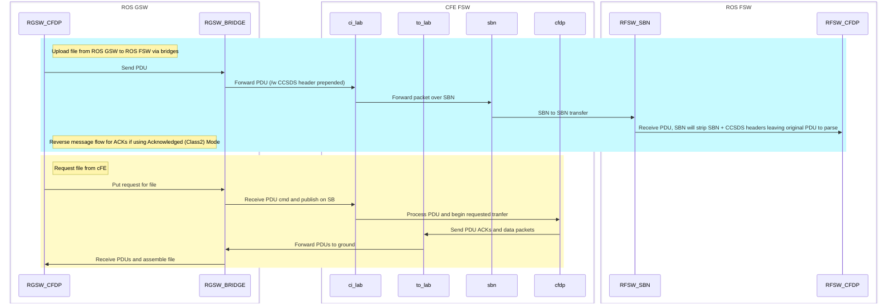

# Usage Examples

The following series of example commands starts 2 instances of the service under a single ROS machine and executes a series of commands.

Start CFDP ROS Fsw and Gsw instances using explicit parameters.  Default values are suitable for RosFsw instance when RosGsw is on a discrete Ros machine.
- `ros2 run cfdp_wrapper cfdp_wrapper.py --ros-args -r __node:=cfdpgsw -p entityID:=1 -p "filestore:=cfdp/rosgsw"`
- `ros2 run cfdp_wrapper cfdp_wrapper.py --ros-args -r __node:=cfdpfsw -p entityID:=2 -p altServices:=True -p "filestore:=cfdp/rosfsw" -p "pduTopicPrefix:=/rosfsw/cfdp/pdu/entity"`

Directory listing (CFDP RosGsw requests from CFDP RosFsw)
- `ros2 service call /cfdp/cmd/ls cfdp_msgs/srv/CfdpXfrCmd "{src: '/', dst: '/dst1_dirlisting.txt', dstid: 2}"`

Transfer a file from CFDP RosGsw to CFDP RosFsw
- `ros2 service call /cfdp/cmd/put cfdp_msgs/srv/CfdpXfrCmd "{src: '/dst1_dirlisting.txt', dst: '/echodst1_dirlisting.txt', dstid: 2}"`

Get a file from CFDP RosFsw (send request from RosGsw)
- `ros2 service call /cfdp/cmd/get cfdp_msgs/srv/CfdpXfrCmd "{src: '/echodst1_dirlisting.txt', dst: '/echodst1_dirlisting.txt', dstid: 2}"`

Command RosFsw CFDP to initiate a put to RosGSW CFDP
- `ros2 service call /cfdp/cmd/put/entity2 cfdp_msgs/srv/CfdpXfrCmd '{src: "test.txt", dst: "/gswtestdst83a.txt", "dstid":1}'`

CFDP RosGsw to Fsw (put)
- `"ros2 service call /cfdp/cmd/put cfdp_msgs/srv/CfdpXfrCmd '{\"src\": \"gswtest.txt\", \"dst\": \"/cf/gswtestdst724c.txt\", \"dstid\":25}'"`
CFDP Fsw to RosFsw (put)
- `fsw-extract cmd 127.0.0.1 --port 1234 --cmd CF.TX --args '{"cfdp_class":0,"keep":1,"chan_num":1,"priority":0,"dest_id":2,"src_filename":"/cf/gswtestdst714a.txt","dst_filename":"fsw2rfsw724e.txt"}'`
CFDP RosFsw to Fsw (put)
- `"ros2 service call /cfdp/cmd/put/entity2 cfdp_msgs/srv/CfdpXfrCmd '{src: \"test.txt\", dst: \"/cf/fswtestdst724f.txt\", \"dstid\":25}'"`
CFDP RosGsw to RosFsw (put)
- `"ros2 service call /cfdp/cmd/put cfdp_msgs/srv/CfdpXfrCmd '{src: \"gswtest.txt\", dst: \"/fswtestdst83c.txt\", \"dstid\":2}'"`
CFDP RosFsw to RosGsw (put)
- `"ros2 service call /cfdp/cmd/put/entity2 cfdp_msgs/srv/CfdpXfrCmd '{src: \"test.txt\", dst: \"/gswtestdst83a.txt\", \"dstid\":1}'"`

Caveats:
- ls and get commands do NOT work against the cFE CF[DP] application at this time (not supported). Use the CF app commands instead for equivalent functionality.

# Overview
This repository defines a ROS2 application implementing the CCSDS File Delivery Protocol (CFDP), as implemented by the open-source Python3 CFDP library.  This dependency can be installed with `pip install cfdp`

This application receives local commands through ROS2 service calls as described below.

It communicates to remote entities by exchanging PDUs (of the ROS CfdpPdu type) on topics of the form `/cfdp/pdu/entity#`, where # is the target entity number.  For example, if this instance is instantiated with a local entity ID of 1, and a second instance exists with an entity ID of 2, then it will listen for messages at `/cfdp/pdu/entity1` and send to `/cfdp/pdu/entity2`.

It is left for other ROS entities to bridge the PDU content to interface with external entities.  For example, by appending a CCSDS Command (including primary and secondary header) and sending over a UDP socket to a cFE instance running ci_lab, while receiving PDUs from to_lab in an equivalent pattern.  The translation bridge should map entity IDs to distinct CCSDS MIDs and/or other appropriate routing details.

# Local Commands
Local commands can be issued from the local ROS instance, for example:

`ros2 service call /cfdp/cmd/put cfdp_msgs/srv/CfdpXfrCmd "{src: '/test.txt', dst: '/test.txt.dst', dstid: 1}"`

All commands are named with the topic format `/cfdp/cmd/$CMD`.  All paths are as defined by the entity. For instances of this application, they are relative to the directory the service was started from.

## ls

Generate a directory listing and transfer it to the local instance as a file with the specified name.

WARNING: This command may not be supported by all CFDP clients (does not appear to work with the open-source cFE CF application).

This command uses the CfdpXfrCmd message type where:
- dstid is the CFDP Entity ID to execute the directory listing on
- src is the directory path to list
- dst is the desired name of the file to save the directory listing to.
- ack is a boolean. If true, use CFDP class 2, Acknowledged Mode. Else use unacknowledged class 1.

## get

Transfer a file from the remote entity to the local entity.  This is implemented as a Proxy request for the remote entity to PUT a file to this instance.

This command uses the CfdpXfrCmd message type where:
- dstid is the CFDP Entity ID to execute the directory listing on
- src is the remote file to send
- dst is the desired name of the file to be saved locally.
- ack is a boolean. If true, use CFDP class 2, Acknowledged Mode. Else use unacknowledged class 1.

## put

Transfer a file from the local entity to the remote entity.

This command uses the CfdpXfrCmd message type where:
- dstid is the CFDP Entity ID to execute the directory listing on
- src is the local file to send
- dst is the desired name of the file to be saved on the remote entity.
- ack is a boolean. If true, use CFDP class 2, Acknowledged Mode. Else use unacknowledged class 1.

## File operations

The following commands operate on a single (remote) file or directory and support the following parameters:

- dstid is the CFDP Entity ID to execute the directory listing on
- tgt is the desired file/folder to manipulate on the remote entity.
- ack is a boolean. If true, use CFDP class 2, Acknowledged Mode. Else use unacknowledged class 1.

### mkdir

Create a directory on the remote insteance identified by dstid.

### rmdir

Delete a directory on the remote instance.  

Note: Remote instance may not permit deletion of non-empty directories.

### touch

Create a blank file on the remote instance.

### rm

Delete a single file on the remote instance.

# Configuration

A configuration file (specified as the ROS parameter 'config') points
to a YAML file defining a listing of all known CFDP Entities and
relevant configuration details. This definition should match that
available to all other entities (including cFE's CFDP app via it's
table services).  A default configuration can be found in `cfdp_wrapper/config`.

Protocol Data Units (PDUs) are transmitted on a ROS
topic of `/cfdp/pdu/entity$entityID`.

entityID is a required parameter to this application, currently
defaulitng to a value of 2.  This field defines the entityID of this
application instance.  This value is automatically populated in
outgoing PDUs, and is used to construct the topic
(`/cfdp/pdu/entity$entityID`) we listen on for incoming PDUs.

altServices is a boolean parameter that causes this instance to append  `/entity$entityId` to all command services it is listening on.  This allows multiple CFDP application instances to operate on a single ROS instance for test purposes (be sure to also specify an alternate ROS Node name for each).

